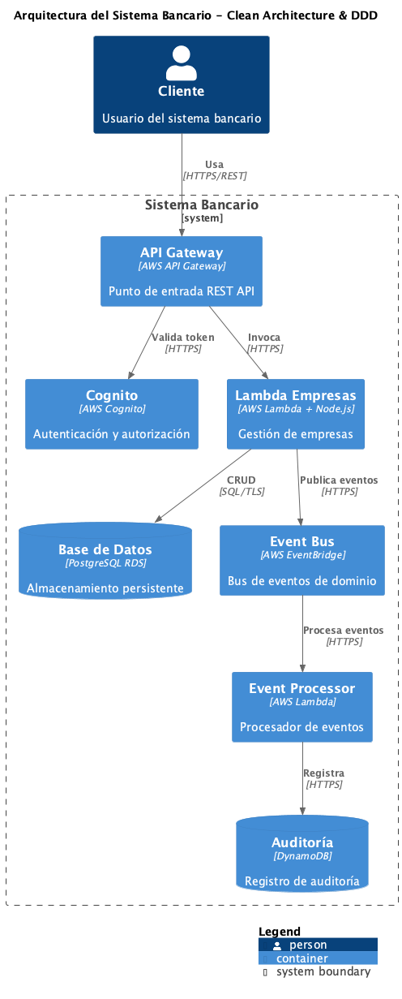
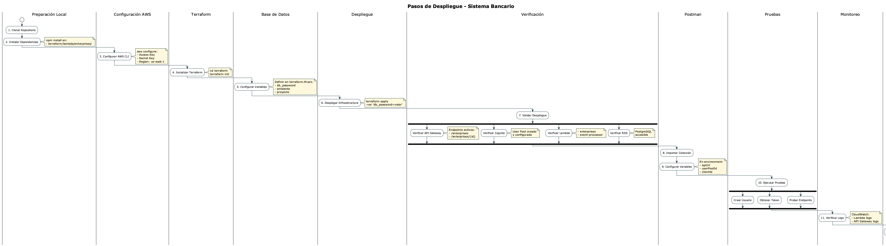

# Sistema Bancario API

> **Nota Importante**: Este proyecto sigue una convención bilingüe donde la documentación de uso está en español para facilitar el diagnóstico y la interacción con usuarios, mientras que todo el código, nombres de funciones, variables y documentación técnica están en inglés siguiendo las mejores prácticas de desarrollo.

## 📚 Documentación

### En Español
- [🚀 Guía Rápida](docs/es/guia-rapida.md) - Inicio rápido y comandos comunes
- [🔄 Sistema de Eventos](docs/es/eventos.md) - Documentación del sistema de eventos
- [🌎 Convenciones de Idioma](docs/es/convenciones-idioma.md) - Guía de uso de español e inglés
- [📄 Resumen del Sistema](README.md#resumen-en-español) - Descripción general del sistema bancario
- [📝 Documentación de API](docs/es/api/endpoints.md) - Descripción detallada de endpoints
- [🔧 Guía de Solución de Problemas](docs/es/troubleshooting/guia.md) - Solución de problemas comunes

### In English
- [📖 Technical Documentation](docs/en/technical.md) - Architecture, code examples and development guidelines
- [🔌 API Documentation](docs/en/api/endpoints.md) - Detailed API endpoints documentation
- [🛠️ Troubleshooting Guide](docs/en/troubleshooting/guide.md) - Common issues and solutions

## 🚀 Inicio Rápido

```bash
# 1. Configurar AWS
source terraform/config_aws.sh

# 2. Instalar dependencias
npm install

# 3. Crear infraestructura
cd terraform && terraform apply -auto-approve

# 4. Probar el sistema
./scripts/diagnostico.sh
```

## 🛠️ Scripts de Diagnóstico

```bash
# Diagnóstico general
./scripts/diagnostico.sh

# Ver logs
./scripts/ver-logs.sh

# Ver eventos
./scripts/ver-eventos.sh

# Pruebas de integración
./scripts/pruebas-integracion.sh

# Pruebas de carga
./scripts/pruebas-carga.sh
```

## 🏗️ Estructura del Proyecto

```
.
├── src/                    # Código fuente
│   ├── domain/            # Capa de dominio
│   │   ├── aggregates/    # Agregados DDD
│   │   ├── entities/      # Entidades
│   │   ├── events/        # Eventos de dominio
│   │   └── value-objects/ # Objetos de valor
│   ├── application/       # Capa de aplicación
│   │   ├── commands/      # Comandos CQRS
│   │   ├── queries/       # Consultas CQRS
│   │   └── services/      # Servicios de aplicación
│   ├── infrastructure/    # Capa de infraestructura
│   │   ├── persistence/   # Persistencia
│   │   ├── messaging/     # Mensajería
│   │   └── auth/         # Autenticación
│   └── interface/         # Capa de interfaz
│       ├── api/          # API REST
│       └── events/       # Manejadores de eventos
├── docs/                  # Documentación
│   ├── es/               # Documentación en español
│   │   ├── api/         # Documentación de API
│   │   └── troubleshooting/ # Solución de problemas
│   └── en/               # Technical documentation
│       ├── api/         # API documentation
│       └── troubleshooting/ # Troubleshooting guide
├── scripts/              # Scripts de diagnóstico
└── terraform/            # Infraestructura como código
    ├── modules/         # Módulos de Terraform
    └── lambda/          # Código de funciones Lambda
```

## 🌟 Características

### Arquitectura
- ✨ Clean Architecture con separación clara de responsabilidades
- 🎯 Domain-Driven Design (DDD) para modelado de dominio
- 📦 CQRS para separación de operaciones de lectura/escritura
- 🔄 Event-Driven Architecture para desacoplamiento
- 🚀 Serverless con AWS Lambda para escalabilidad

### Seguridad
- 🔐 Autenticación con AWS Cognito
- 🛡️ Autorización basada en roles
- 🔒 Validación de datos robusta
- 📝 Auditoría completa con DynamoDB

### DevOps
- 🔄 CI/CD con GitHub Actions
- 📊 Monitoreo con CloudWatch
- 🚨 Alertas automáticas
- 🔍 Logging estructurado

### Calidad
- ✅ Pruebas unitarias
- 🔄 Pruebas de integración
- 🚦 Pruebas de carga
- 📈 Métricas de rendimiento

## 📊 Diagramas

### Arquitectura del Sistema


### Diagramas



## 🔍 Monitoreo y Métricas

### CloudWatch Dashboards
- [Dashboard Principal](https://console.aws.amazon.com/cloudwatch/home?region=us-east-1#dashboards:name=sistema-bancario)
- [Métricas de API](https://console.aws.amazon.com/cloudwatch/home?region=us-east-1#dashboards:name=sistema-bancario-api)
- [Logs de Lambda](https://console.aws.amazon.com/cloudwatch/home?region=us-east-1#logsV2:log-groups)

### Alertas
- Latencia alta de API
- Errores de Lambda
- Uso de CPU en RDS
- Fallos de autenticación

## 📝 Licencia

Este proyecto está licenciado bajo la Licencia MIT - ver el archivo [LICENSE](LICENSE) para más detalles.

## 🤝 Contribuir

1. Fork el proyecto
2. Crear una rama (`git checkout -b feature/AmazingFeature`)
3. Commit los cambios (`git commit -m 'Add some AmazingFeature'`)
4. Push a la rama (`git push origin feature/AmazingFeature`)
5. Abrir un Pull Request

## 📫 Contacto

- Email: soporte@sistema-bancario.com
- Slack: #sistema-bancario-support
- GitHub Issues: [Crear un issue](https://github.com/usuario/sistema-bancario/issues)
